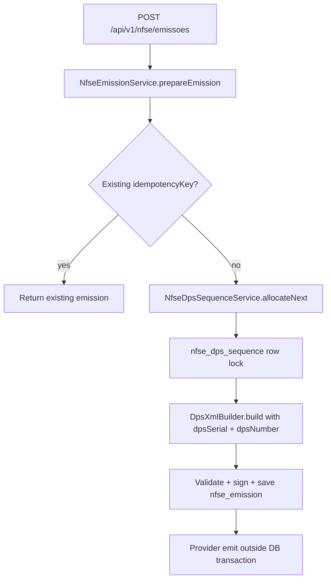

# NFS-e DPS Sequence Design

**Spec**: `.specs/features/nfse-dps-sequence/spec.md`
**Status**: Draft

---

## Architecture Overview

Recommended approach: add a dedicated JPA sequence entity and repository, allocate the next number inside the existing `NfseEmissionService.prepareEmission` transaction, and pass the allocated number into `DpsXmlBuilder`. This keeps the transaction boundary already used for emission preparation and avoids provider calls while holding database locks.

Alternative considered: use a native PostgreSQL sequence per issuer/series. That would allocate safely but makes dynamic per-issuer setup and lookup harder, and it would not satisfy the requested table shape as the authoritative sequence store.

Alternative considered: increment after provider authorization. That avoids gaps for provider failures, but it cannot produce the DPS XML number before submission and risks reuse after a partial external send.



---

## Code Reuse Analysis

### Existing Components to Leverage

| Component | Location | How to Use |
| --------- | -------- | ---------- |
| Emission transaction flow | `src/main/java/br/com/alvexustech/nfse/service/NfseEmissionService.java` | Keep allocation inside `prepareEmission` before XML generation. |
| DPS XML formatting helpers | `src/main/java/br/com/alvexustech/nfse/service/DpsXmlBuilder.java` | Reuse series normalization and ID padding behavior, but remove idempotency-derived number generation. |
| JPA entity style | `src/main/java/br/com/alvexustech/nfse/persistence/NfseEmissionEntity.java` | Mirror field annotations, UUID primary key, and protected no-arg constructor. |
| Repository style | `src/main/java/br/com/alvexustech/nfse/repository/NfseEmissionRepository.java` | Add a Spring Data JPA repository for the sequence entity. |
| Flyway migrations | `src/main/resources/db/migration/V1__create_nfse_emission.sql` | Add `V2__create_nfse_dps_sequence.sql` for additive schema changes. |
| Existing XML test style | `src/test/java/br/com/alvexustech/nfse/service/DpsXmlBuilderTest.java` | Extend unit coverage for allocated DPS numbers and ID formatting. |

### Integration Points

| System | Integration Method |
| ------ | ------------------ |
| Database | New `nfse_dps_sequence` table; optional new `dps_serial` and `dps_number` columns on `nfse_emission`. |
| Emission service | Inject `NfseDpsSequenceService`; allocate only after idempotency miss. |
| XML builder | Change builder API to accept allocated DPS serial/number. |

---

## Components

### NfseDpsSequenceEntity

- **Purpose**: Map the persistent sequence state for one issuer and DPS series.
- **Location**: `src/main/java/br/com/alvexustech/nfse/persistence/NfseDpsSequenceEntity.java`
- **Fields**:
  - `UUID id`
  - `String issuerCnpj`
  - `Integer dpsSerial`
  - `Long lastDpsIssued`
- **Dependencies**: Jakarta Persistence.
- **Reuses**: Existing entity conventions from `NfseEmissionEntity`.

### NfseDpsSequenceRepository

- **Purpose**: Acquire and persist sequence rows.
- **Location**: `src/main/java/br/com/alvexustech/nfse/repository/NfseDpsSequenceRepository.java`
- **Interfaces**:
  - `Optional<NfseDpsSequenceEntity> findByIssuerCnpjAndDpsSerial(String issuerCnpj, Integer dpsSerial)`
  - Locking query for the same key using `@Lock(PESSIMISTIC_WRITE)`
- **Dependencies**: Spring Data JPA.
- **Reuses**: Repository pattern from `NfseEmissionRepository`.

### NfseDpsSequenceService

- **Purpose**: Validate issuer/series, lock or create the sequence row, increment safely, and return the allocated number.
- **Location**: `src/main/java/br/com/alvexustech/nfse/service/NfseDpsSequenceService.java`
- **Interfaces**:
  - `AllocatedDps allocateNext(String issuerCnpj, String configuredSerieDps)`
  - `AllocatedDps(Integer serial, Long number)` record
- **Dependencies**: `NfseDpsSequenceRepository`.
- **Reuses**: Digit normalization rules currently present in `DpsXmlBuilder`.

### DpsXmlBuilder

- **Purpose**: Build DPS XML from request data and caller-provided fiscal numbering.
- **Location**: `src/main/java/br/com/alvexustech/nfse/service/DpsXmlBuilder.java`
- **Interfaces**:
  - `DpsXml build(EmitirNfseRequest request, int dpsSerial, long dpsNumber)`
- **Dependencies**: Existing configuration properties.
- **Reuses**: Current XML creation, validation-compatible formatting, and ID creation.

### NfseEmissionEntity

- **Purpose**: Store generated DPS serial and number with the emission record for audit and idempotent inspection.
- **Location**: `src/main/java/br/com/alvexustech/nfse/persistence/NfseEmissionEntity.java`
- **Fields to add**:
  - `Integer dpsSerial`
  - `Long dpsNumber`
- **Dependencies**: Existing Flyway migration additions.
- **Reuses**: Current constructor/getter/setter style.

---

## Data Models

### `nfse_dps_sequence`

```sql
CREATE TABLE nfse_dps_sequence (
    id UUID PRIMARY KEY,
    issuer_cnpj VARCHAR(14) NOT NULL,
    dps_serial NUMERIC(5, 0) NOT NULL,
    last_dps_issued NUMERIC(15, 0) NOT NULL DEFAULT 0,
    created_at TIMESTAMP WITH TIME ZONE NOT NULL,
    updated_at TIMESTAMP WITH TIME ZONE NOT NULL,
    CONSTRAINT uq_nfse_dps_sequence_issuer_serial UNIQUE (issuer_cnpj, dps_serial),
    CONSTRAINT chk_nfse_dps_sequence_last_non_negative CHECK (last_dps_issued >= 0)
);
```

### `nfse_emission` additions

```sql
ALTER TABLE nfse_emission
    ADD COLUMN dps_serial NUMERIC(5, 0),
    ADD COLUMN dps_number NUMERIC(15, 0);

CREATE INDEX idx_nfse_emission_issuer_dps
    ON nfse_emission (issuer_cnpj, dps_serial, dps_number);
```

**Relationships**: `nfse_emission.issuer_cnpj + dps_serial + dps_number` records the generated value. `nfse_dps_sequence` stores only the latest counter by issuer and serial.

---

## Error Handling Strategy

| Error Scenario | Handling | User Impact |
| -------------- | -------- | ----------- |
| Invalid issuer CNPJ length | Throw validation-style `IllegalArgumentException` before allocation. | Existing global error handler returns a client error where applicable. |
| Invalid configured DPS series | Throw before allocation. | Emission fails without consuming a number. |
| Sequence upper bound exceeded | Throw before incrementing beyond 15 digits. | Emission fails without producing invalid XML. |
| Race creating first row | Retry locked lookup after unique constraint conflict, then allocate. | Request may take slightly longer but must not duplicate numbers. |
| Provider failure after signed XML saved | Existing `markFailed` behavior marks emission failed; sequence remains advanced. | Number is consumed and auditable in `nfse_emission`. |

---

## Risks & Concerns

| Concern | Location (file:line) | Impact | Mitigation |
| ------- | -------------------- | ------ | ---------- |
| `DpsXmlBuilder` currently derives `nDPS` from `idempotencyKey` | `src/main/java/br/com/alvexustech/nfse/service/DpsXmlBuilder.java:168` | Fiscal numbers are not sequence-backed. | Replace with caller-provided allocated number and cover with XML tests. |
| `prepareEmission` builds XML before saving the emission | `src/main/java/br/com/alvexustech/nfse/service/NfseEmissionService.java:93` | Sequence allocation must happen in the same transaction and roll back on local preparation failure. | Allocate inside the existing `TransactionTemplate` callback before XML build. |
| Only one test currently exists | `src/test/java/br/com/alvexustech/nfse/service/DpsXmlBuilderTest.java:1` | Service/repository concurrency behavior is untested. | Add focused unit tests and database-backed tests for allocation/idempotency/concurrency. |
| PostgreSQL `NUMERIC` maps less naturally to Java primitives | `src/main/resources/db/migration/V1__create_nfse_emission.sql:1` | Hibernate validation can fail if precision/scale mismatch. | Use explicit `@Column(precision = 5, scale = 0)` and `@Column(precision = 15, scale = 0)`; choose `Integer`/`Long` only after validation. |

---

## Tech Decisions

| Decision | Choice | Rationale |
| -------- | ------ | --------- |
| Allocation strategy | JPA pessimistic write lock on sequence row | Simple, database-enforced serialization using the existing stack. |
| First-use behavior | Auto-create sequence row at zero | Avoids requiring a separate seed workflow for MVP. |
| XML builder responsibility | Accept allocated number, do not allocate | Keeps persistence and concurrency outside XML formatting code. |
| Sequence audit | Store `dps_serial` and `dps_number` on emission | Avoid parsing XML to diagnose generated fiscal numbering. |

No project-level decisions are introduced yet; all choices are feature-local until approved.
