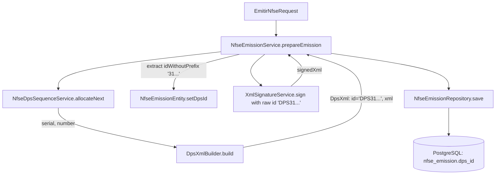

# NFS-e Emission DPS_ID Design

**Spec**: `.specs/features/nfse-emission-dps-id/spec.md`
**Status**: Draft

---

## Architecture Overview

During emission preparation, `NfseEmissionService` requests the allocated DPS serial/number, then calls `DpsXmlBuilder.build(...)`. The builder creates the XML DOM with `<infDPS Id="...">` containing `"DPS" + {42 digits}`.

To persist `dps_id` without the `"DPS"` prefix:
1. `DpsXmlBuilder.DpsXml` record exposes a helper method `idWithoutPrefix()` (or `stripDpsPrefix(String id)`) which removes `"DPS"` from the start of the ID string if present.
2. `NfseEmissionService` assigns `dpsId` to `NfseEmissionEntity` during `prepareEmission()`.
3. `NfseEmissionEntity` maps `dps_id VARCHAR(50)`.
4. Flyway migration `V3__add_dps_id_to_nfse_emission.sql` creates the column and index in PostgreSQL.



---

## Code Reuse Analysis

### Existing Components to Leverage

| Component | Location | How to Use |
| --------- | -------- | ---------- |
| `DpsXmlBuilder.DpsXml` | `src/main/java/br/com/alvexustech/nfse/service/DpsXmlBuilder.java` | Add accessor `idWithoutPrefix()` to encapsulate prefix stripping cleanly. |
| `NfseEmissionEntity` | `src/main/java/br/com/alvexustech/nfse/persistence/NfseEmissionEntity.java` | Add `@Column(name = "dps_id", length = 50)` and getter/setter following existing entity patterns. |
| `NfseEmissionService` | `src/main/java/br/com/alvexustech/nfse/service/NfseEmissionService.java` | In `prepareEmission`, set `entity.setDpsId(dpsXml.idWithoutPrefix())`. |
| `NfseEmissionServiceSequenceIntegrationTest` | `src/test/java/.../NfseEmissionServiceSequenceIntegrationTest.java` | Extend integration test to assert `dps_id` persistence and rollback. |
| `NfseDpsSequenceMigrationTest` | `src/test/java/.../NfseDpsSequenceMigrationTest.java` | Add migration assertions for column type, length, nullability, and index. |

### Integration Points

| System | Integration Method |
| ------ | ------------------ |
| Database (`nfse_emission`) | Flyway migration `V3__add_dps_id_to_nfse_emission.sql` alters table and adds index. |
| XML Signature | Signature continues to use `dpsXml.id()` with `"DPS"` prefix as required by XML-DSig and national XSD. |

---

## Components

### `DpsXmlBuilder.DpsXml`
- **Purpose**: Carrier record for generated DPS identifier and raw XML content.
- **Location**: `src/main/java/br/com/alvexustech/nfse/service/DpsXmlBuilder.java`
- **Interfaces**:
  - `idWithoutPrefix(): String` - returns `id` without leading `"DPS"` prefix (null-safe).
- **Dependencies**: None.
- **Reuses**: Existing record `public record DpsXml(String id, String xml)`.

### `NfseEmissionEntity`
- **Purpose**: JPA entity for persisted emissions.
- **Location**: `src/main/java/br/com/alvexustech/nfse/persistence/NfseEmissionEntity.java`
- **Interfaces**:
  - `getDpsId(): String`
  - `setDpsId(String dpsId): void`
- **Dependencies**: Jakarta Persistence annotations.
- **Reuses**: Existing `@Entity` mapping and lifecycle hooks.

### `NfseEmissionService`
- **Purpose**: Orchestrates emission preparation and provider submission.
- **Location**: `src/main/java/br/com/alvexustech/nfse/service/NfseEmissionService.java`
- **Interfaces**:
  - `emit(EmitirNfseRequest): Mono<EmitirNfseResponse>`
- **Dependencies**: `DpsXmlBuilder`, `NfseEmissionRepository`.
- **Reuses**: Existing `prepareEmission` transaction.

---

## Data Models

### Flyway Migration `V3__add_dps_id_to_nfse_emission.sql`
```sql
ALTER TABLE nfse_emission
    ADD COLUMN dps_id VARCHAR(50);

CREATE INDEX idx_nfse_emission_dps_id
    ON nfse_emission (dps_id);
```

### JPA Mapping
```java
@Column(name = "dps_id", length = 50)
private String dpsId;
```

---

## Error Handling Strategy

| Error Scenario | Handling | User Impact |
| -------------- | -------- | ----------- |
| `DpsXml.id()` is null or blank | `idWithoutPrefix()` returns `id` as is (null or blank); does not throw NPE | Emission proceeds; `dps_id` is null/empty in DB |
| Generated `id` does not begin with `"DPS"` | Prefix removal is a no-op; retains original string | Raw ID is preserved without data corruption |
| Preparation fails (e.g. signature or schema validation) | Transaction rollback aborts entity save | No partial row or orphaned `dps_id` persisted |

---

## Risks & Concerns

| Concern | Location (file:line) | Impact | Mitigation |
| ------- | -------------------- | ------ | ---------- |
| XML Schema requirement for `infDPS/@Id` | `DpsXmlBuilder.java:58-59` | National standard requires `Id="DPS..."`. Stripping prefix from XML would cause XSD validation failure. | Keep `"DPS"` prefix intact in `DpsXml.id()` and XML; only strip prefix when storing to `entity.setDpsId(...)`. |
| Nullability for existing records | `V3__add_dps_id_to_nfse_emission.sql` | Existing historical emissions do not have `dps_id`. | Column must remain nullable (`NULL`), allowing backward compatibility. |

---

## Tech Decisions

| Decision | Choice | Rationale |
| -------- | ------ | --------- |
| Encapsulate prefix stripping | Method on `DpsXml` record | Avoids duplicating substring/regex logic across caller services and test cases. |
| Column length `VARCHAR(50)` | 50 characters | National DPS ID without prefix is 42 chars; 50 provides comfortable margin while remaining index-friendly. |
| Index type | B-tree index on `dps_id` | Facilitates direct lookup by DPS fiscal ID without table scan. |
